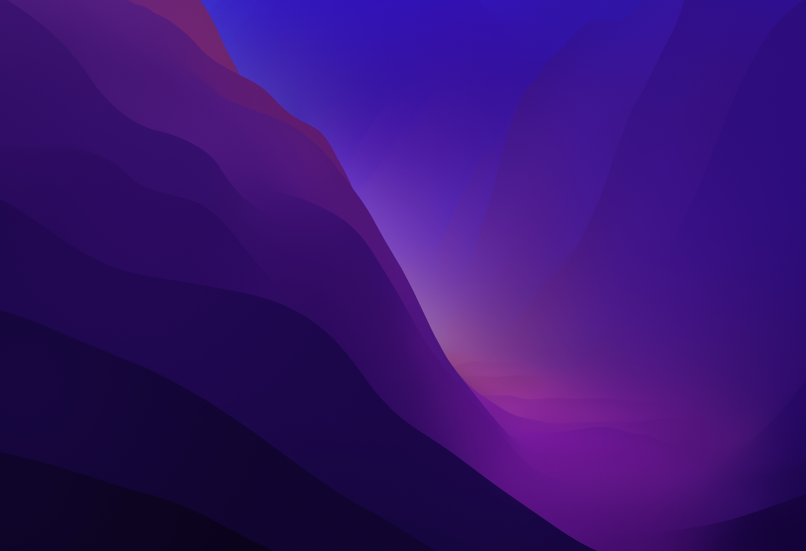
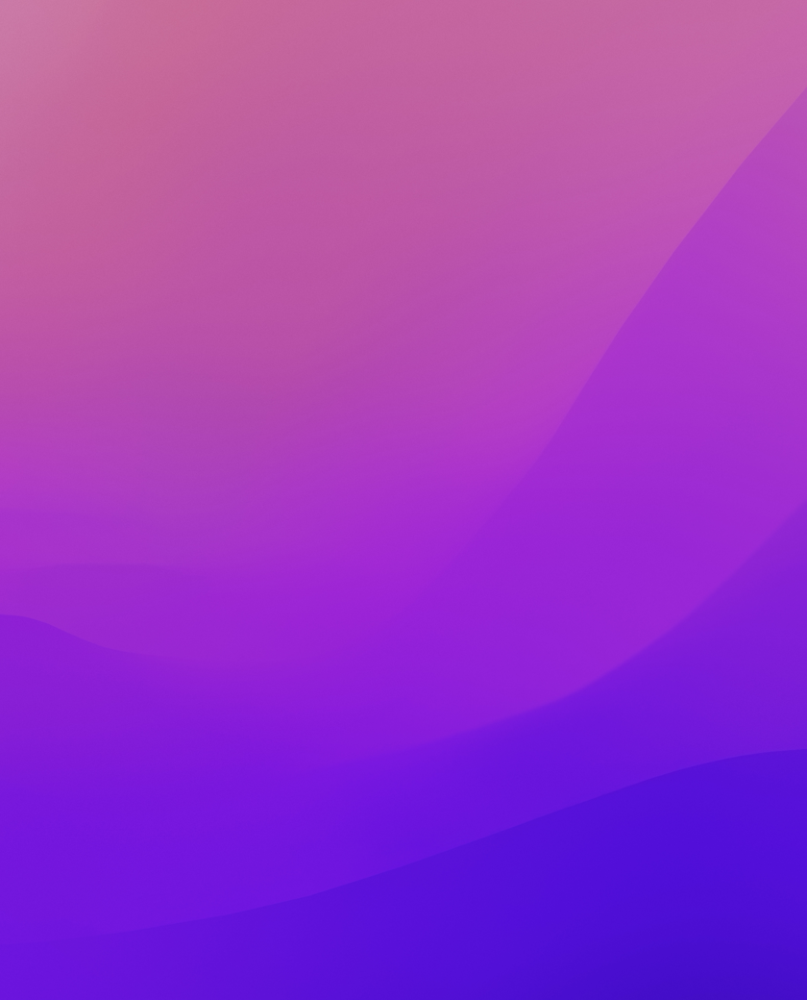
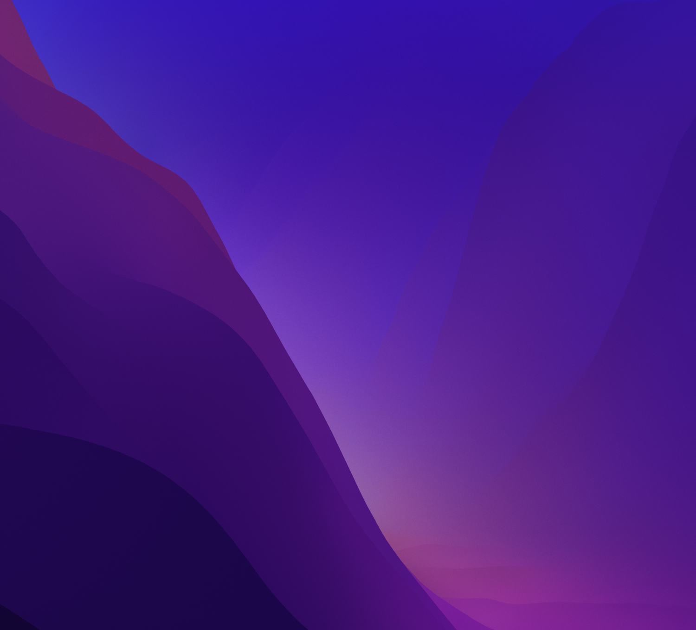

# MacDock (RightDock)

<p align="center">
  <strong>macOS 右侧双区程序坞 · A dual-zone dock for the right edge of your Mac</strong>
</p>

<p align="center">
  <a href="#中文">中文</a> · <a href="#english">English</a>
</p>

---

## 中文

**MacDock**（应用名 **RightDock**）是一款原生 macOS 程序坞替代品，将 Dock 固定在屏幕**右侧**，分为上下两个区域：上区按**窗口**列出当前运行的应用，下区为可自定义的**固定快捷方式**。支持隐藏系统底部 Dock、窗口与 Dock 左缘对齐、拖拽调节宽度等能力，适合宽屏、竖屏或多显示器用户。

### 预览

| 桌面概览（Dock + 窗口对齐） | 右侧 Dock 面板 |
|:---:|:---:|
|  |  |

| 菜单栏控制 | 设置面板 |
|:---:|:---:|
|  |  |

### 主要功能

- **右侧双区布局**
  - **上区**：按窗口列出运行中的应用（同一 App 多个窗口各占一条，例如两个 Cursor 窗口）
  - **下区**：固定快捷方式，仅显示图标，宽度不足时自动换行
- **灵活外观**
  - Dock 宽度可调（默认 108 pt，范围 72–220 pt）
  - 拖拽 Dock **左边缘握把**（三条竖线）实时调节宽度
  - 图标大小（小 / 中 / 大）、上区是否显示标题
- **固定快捷方式**
  - 从「应用程序」或访达**拖入 `.app`** 添加
  - 设置中输入 Bundle ID 或从运行中的应用选取
  - 支持拖拽排序、右键移除
- **窗口管理**
  - 点击上区条目聚焦对应窗口（需辅助功能授权）
  - 右键窗口条目可重命名显示标题
  - **Option + 点绿色按钮**「填满屏幕」时，窗口右缘与 Dock 左缘对齐
- **替换系统程序坞**
  - 可隐藏屏幕底部系统 Dock，退出 RightDock 后自动恢复
  - 菜单栏提供「恢复系统程序坞（底部）」快捷操作
- **菜单栏常驻**
  - 以辅助程序（`accessory`）方式运行，不占用系统 Dock 位置
  - 左键点击菜单栏 **Dock** 图标显示/置顶面板，右键打开完整菜单

### 系统要求

- macOS 13 (Ventura) 或更高版本
- Apple Silicon 或 Intel Mac

### 安装与运行

#### 方式一：一键安装（推荐）

```bash
cd RightDock
./scripts/install.sh
```

脚本会编译应用、安装到 `/Applications/RightDock.app` 并自动启动。之后可从**启动台**或**应用程序**文件夹像普通 Mac 软件一样使用。

#### 方式二：直接运行已打包的 App

若项目中已有 `RightDock.app`，可直接双击运行。

#### 开发者构建

```bash
cd RightDock
./scripts/build-app.sh    # 生成 RightDock.app
./scripts/install.sh      # 安装到 /Applications 并启动
```

### 首次使用：辅助功能授权

窗口聚焦、拖放固定应用等功能需要 **辅助功能** 权限：

1. 打开 **系统设置 → 隐私与安全性 → 辅助功能**
2. 若列表中已有旧的 RightDock 条目，先点 **「−」** 删除
3. 点 **「+」** 添加 `/Applications/RightDock.app`
4. 打开开关
5. 菜单栏 Dock 菜单应显示「辅助功能已生效 ✓」



若授权后仍无效，可在终端执行后重复上述步骤：

```bash
sudo tccutil reset Accessibility com.mactools.RightDock
```

### 常用操作

| 操作 | 方法 |
|------|------|
| 调节 Dock 宽度 | 拖拽 Dock 左边缘握把，或在设置中拖动滑块 |
| 打开设置 | 右键 Dock 面板 / 菜单栏 Dock → **设置…**（⌘,） |
| 添加固定应用 | 从访达拖 `.app` 到下区，或在设置中添加 Bundle ID |
| 隐藏 / 显示 Dock | 菜单栏 Dock → 隐藏 / 显示 RightDock |
| 开机自启 | **系统设置 → 通用 → 登录项** → 添加 RightDock |
| 恢复系统 Dock | 菜单栏 Dock → **恢复系统程序坞（底部）** |

### 项目结构

```
MacDock/
├── README.md                 # 本文件
└── RightDock/
    ├── Package.swift         # Swift Package 定义
    ├── Sources/RightDock/    # 应用源码
    ├── Resources/            # Info.plist、Entitlements
    ├── scripts/              # 构建、安装、截图脚本
    └── docs/screenshots/     # 文档截图
```

### 技术栈

- **语言**：Swift 5.9+
- **UI 框架**：SwiftUI + AppKit
- **构建**：Swift Package Manager（无需 Xcode 工程文件）
- **权限**：Accessibility API（窗口枚举与聚焦）

### 开源协议

MIT License — 详见 [LICENSE](LICENSE)

---

## English

**MacDock** (app name **RightDock**) is a native macOS dock replacement that pins a **dual-zone dock** to the **right edge** of your screen. The upper zone lists **running windows** (one row per window), and the lower zone holds **pinned shortcuts**. It can replace the system bottom Dock, align maximized windows with the dock edge, and supports drag-to-resize — ideal for ultrawide, portrait, or multi-monitor setups.

### Preview

| Desktop overview (dock + aligned window) | Right-side dock panel |
|:---:|:---:|
|  |  |

| Menu bar controls | Settings |
|:---:|:---:|
|  |  |

### Key Features

- **Dual-zone right dock**
  - **Upper zone**: lists running apps **by window** (multiple windows from the same app get separate rows)
  - **Lower zone**: pinned shortcuts, icons only, wraps to multiple rows when space is tight
- **Customizable appearance**
  - Adjustable dock width (default 108 pt, range 72–220 pt)
  - Drag the **left-edge grip** (three vertical lines) to resize in real time
  - Icon size (S / M / L) and optional window titles in the upper zone
- **Pinned shortcuts**
  - Drag `.app` bundles from Finder into the lower zone
  - Add by Bundle ID or pick from running apps in Settings
  - Reorder via drag-and-drop; remove via context menu
- **Window management**
  - Click an upper-zone row to focus that window (requires Accessibility permission)
  - Rename window labels via context menu
  - With **Option + green button** “Fill Screen”, window right edge aligns with the dock’s left edge
- **Replace system Dock**
  - Optionally hide the bottom system Dock; restored automatically when you quit RightDock
  - “Restore system Dock (bottom)” available from the menu bar menu
- **Menu bar agent**
  - Runs as an `accessory` app — no icon in the system Dock
  - Left-click the menu bar **Dock** item to show/bring-to-front; right-click for the full menu

### Requirements

- macOS 13 (Ventura) or later
- Apple Silicon or Intel Mac

### Installation

#### Option 1: One-click install (recommended)

```bash
cd RightDock
./scripts/install.sh
```

This builds the app, installs it to `/Applications/RightDock.app`, and launches it. Use Launchpad or Applications like any other Mac app.

#### Option 2: Run the bundled app

If `RightDock.app` is already present in the project, double-click to run.

#### For developers

```bash
cd RightDock
./scripts/build-app.sh    # Build RightDock.app
./scripts/install.sh      # Install to /Applications and launch
```

### First launch: Accessibility permission

Window focus and drag-to-pin require **Accessibility** access:

1. Open **System Settings → Privacy & Security → Accessibility**
2. Remove any stale RightDock entries with **「−」**
3. Click **「+」** and add `/Applications/RightDock.app`
4. Enable the toggle
5. The menu bar Dock menu should show accessibility as active ✓


If permission still fails after granting access:

```bash
sudo tccutil reset Accessibility com.mactools.RightDock
```

### Quick reference

| Action | How |
|--------|-----|
| Resize dock width | Drag the left-edge grip, or use the slider in Settings |
| Open Settings | Right-click the dock / menu bar Dock → **Settings…** (⌘,) |
| Pin an app | Drag `.app` to the lower zone, or add Bundle ID in Settings |
| Hide / show dock | Menu bar Dock → Hide / Show RightDock |
| Launch at login | **System Settings → General → Login Items** → add RightDock |
| Restore system Dock | Menu bar Dock → **Restore system Dock (bottom)** |

### Project layout

```
MacDock/
├── README.md
└── RightDock/
    ├── Package.swift
    ├── Sources/RightDock/
    ├── Resources/
    ├── scripts/
    └── docs/screenshots/
```

### Tech stack

- **Language**: Swift 5.9+
- **UI**: SwiftUI + AppKit
- **Build**: Swift Package Manager (no Xcode project required)
- **APIs**: Accessibility framework for window enumeration and focus

### License

MIT License — see [LICENSE](LICENSE)
